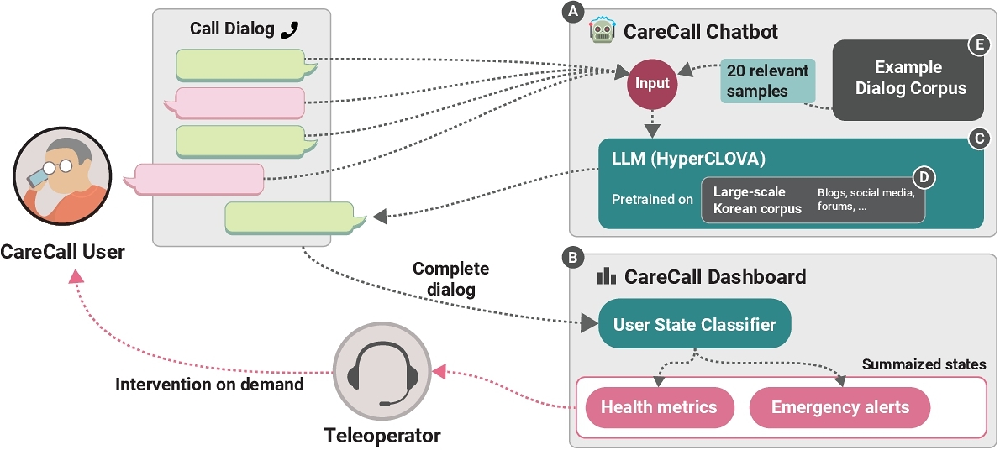

## Understanding the Benefits and Challenges of Deploying Conversational AI Leveraging Large Language Models for Public Health Intervention

Eunkyung Jo ∗ University of California, Irvine USA eunkyuj@uci.edu

Daniel A. Epstein University of California, Irvine USA epstein@ics.uci.edu

Hyunhoon Jung NAVER CLOUD Seongnam, Gyeonggi Republic of Korea hyunhoon.j@navercorp.com

Young-Ho Kim NAVER AI Lab Seongnam, Gyeonggi Republic of Korea yghokim@younghokim.net

---
layout: center
---

# INTRODUCTION

---

# Overview

- Examines CareCall: LLM-powered chatbot for public health support
  - Provides check-up calls for socially isolated individuals
  - Monitored by teleoperators
- Study based on focus groups and interviews with 34 stakeholders:
  - Users
  - Teleoperators
  - Developers
- Key findings:
  - Benefits: holistic user understanding, reduced workload
  - Challenges: meeting health needs, managing expectations

<!--
This study investigates CareCall, a chatbot using large language models to support public health interventions through phone check-ups with socially isolated individuals. The research gathered insights from 34 participants across three stakeholder groups through focus groups and interviews. The findings revealed that while the system helped reduce loneliness and workload, it also faced challenges in delivering health support and managing different stakeholder expectations. The study highlights important considerations for implementing LLM-driven chatbots in public health settings.
-->

---

# Technology in Public Health Monitoring

- Growing use of technology for population health monitoring
- HCI and CSCW communities developed various solutions:
  - Chatbots
  - Mobile apps
- Benefits of automation:
  - Handles routine tasks (FAQs, resource identification)
  - Allows health workers to focus on core care duties

<!--
Technology has become increasingly integrated into public health monitoring systems. The Human-Computer Interaction and Computer-Supported Cooperative Work communities have contributed various technological solutions including chatbots and mobile applications. These automated systems help manage routine aspects of healthcare work such as answering common questions and identifying public resources. This automation enables healthcare workers to dedicate more time to essential care-focused responsibilities like monitoring individual wellbeing.

[Text range: From "Technology has increasingly been used..." to "...monitoring the wellbeing of individuals [27]."]
-->

---

# LLMs: New Opportunities in Healthcare

- Recent AI/NLP advances enable better health interventions
- Traditional chatbots:
  - Task-oriented
  - Rule-based responses
- LLM-powered chatbots:
  - Open-domain dialogue
  - Free-form conversations
  - Empathetic interactions
- Gap: Limited real-world implementation studies

<!--
Advances in AI and natural language processing have created new possibilities for population-level health interventions. While traditional chatbots operate on predefined rules and specific tasks, LLM-powered systems can engage in open-ended, free-flowing conversations with an emphasis on empathy. These systems show promise in supporting populations experiencing health challenges and reaching underserved communities. However, there is currently limited research on how LLM-based chatbots perform in real-world public health settings.

[Text range: From "Advances in artificial intelligence (AI)..." to "...limiting understanding of the benefits and drawbacks of free-form conversations towards addressing public health needs."]
-->

---

# CareCall: System Overview

- Deployed in 20 South Korean municipalities
- Duration: 2-12 months (as of May 2022)
- Target users: Socially isolated individuals
  - Middle-aged adults
  - Older adults living alone
- Key functions:
  - Health monitoring
  - Conversational companionship
  - Real-time dialogue generation

<!--
CareCall represents one of the first real-world deployments of an LLM-driven chatbot in public health. The system has been implemented across 20 municipalities in South Korea, serving middle-aged and older adults who live in social isolation. Through its dual functionality of health monitoring and conversational engagement, CareCall collects health-related data while providing companionship through AI-generated dialogues. The system demonstrates how LLM technology can be practically applied to address public health challenges at scale.

[Text range: From "To understand the benefits and challenges..." to "...CareCall is a useful case for understanding the role of LLM-driven chatbots in public health intervention."]
-->

---

# Key Benefits

- Holistic understanding of individuals
- Reduced workload for teleoperators
- Positive user impact:
  - Reduced loneliness
  - Engaging conversations beyond health topics
  - Caring interactions about wellbeing
  - Interest in personal hobbies

<!--
The teleoperators found that the LLM-driven system helped them develop comprehensive insights into each individual while reducing their workload burden. Users reported positive outcomes from the open-ended nature of conversations, which helped combat feelings of isolation. The system's ability to engage in discussions beyond just health matters, showing interest in users' personal interests and hobbies while still maintaining caring health-focused interactions, proved particularly valuable in providing emotional support.

[Text range: From "From the study, we identified the benefits..." to "...such as asking about hobbies and interests."]
-->

---

# Key Challenges

- Stakeholder expectation misalignment:
  - Municipal authorities: Want specific health questions
  - Developers: Limited control over LLM customization
- System limitations:
  - No long-term memory
  - Impersonal interactions
  - Unclear scope of services
- Resource constraints:
  - Customization costs
  - Integration difficulties

<!--
Municipal authorities desired to incorporate specific health monitoring questions and customize conversations for different target groups, but developers struggled to accommodate these requests due to the inherent uncertainty in controlling LLM outputs and resource-intensive nature of customization. The system's lack of long-term memory led to impersonal interactions as it couldn't reference past health conversations, limiting its emotional support capabilities. Users often expected social services beyond the system's scope, creating additional burden for teleoperators. These limitations highlighted the fundamental challenges in balancing stakeholder needs with technical constraints.

[Text range: From "However, stakeholders often had different needs..." to "...which led to challenges in providing emotional support."]
-->

---

# Research Implications

1. Memory Enhancement
   - Implement long-term memory
   - Improve emotional support capabilities

2. Stakeholder Communication
   - Design resources for expectation management
   - Create processes to negotiate chatbot tradeoffs

3. Scaling Considerations
   - Develop mechanisms for population targeting
   - Enable care professional contributions
   - Build diverse dialog datasets

<!--
Implementing long-term memory capabilities in public health chatbots would enhance their ability to provide personalized emotional support. Resources and processes need to be developed to help stakeholders understand and negotiate the tradeoffs between task-oriented and open-domain chatbots. To scale these systems effectively, mechanisms should be designed that allow target populations and care professionals to contribute to dialog datasets, ensuring the chatbots can address diverse public health needs.

[Text range: From "Based on the findings, we provide greater emotional support..." to "...to scale chatbots to diverse public health needs."]
-->

---

# Key Contributions

1. Real-world LLM Chatbot Analysis
   - Benefits: Emotional support, broad conversations
   - Challenges: Limited personalization, memory constraints
   - Stakeholder tensions around expectations

2. Implementation Guidelines
   - Memory system development
   - Stakeholder communication frameworks
   - Scaling strategies for diverse needs

<!--
This research provides valuable insights into deploying LLM-driven chatbots in public health settings through extensive analysis of 34 stakeholders' experiences with CareCall. While the system demonstrated benefits in providing emotional support and enabling broader conversations, it faced challenges with personalization and memory limitations. The study revealed tensions between stakeholders regarding system capabilities and expectations. These findings inform guidelines for implementing public health chatbots, particularly around developing memory systems, creating frameworks for stakeholder communication, and designing strategies to scale solutions for diverse public health needs.

[Text range: From "The key contributions of this work are twofold:" to "...help target populations or care professionals contribute to dialog datasets to scale chatbots to diverse public health needs."]
-->

---

# Study Methodology

- Focus group workshops: 14 CareCall users
- Individual interviews: 20 stakeholders
  - 5 users
  - 5 teleoperators
  - 10 developers
- Total participants: 34
- Developer roles:
  - System design and implementation
  - Government communication

<!--
The research methodology combined focus group workshops with 14 CareCall users and in-depth interviews with 20 stakeholders across three key groups. The interviewed stakeholders included five system users, five teleoperators who monitored conversation logs, and ten developers. The developers were responsible for both technical implementation and maintaining communication with local government authorities. This comprehensive approach gathered insights from a total of 34 participants who interacted with different aspects of the CareCall system.

[Text range: From "We observed focus group workshops with 14 CareCall users..." to "...who interacted with different aspects of CareCall."]
-->
---
layout: center
---

# RELATED WORK

---

# HCI in Public Health Work

- Technology automates manual care tasks:
  - Answering common questions
  - Resource identification
  - Health data collection
- Benefits:
  - Reduces worker burden
  - Users more comfortable sharing sensitive info
- Limitations:
  - Less empathetic than humans
  - Should complement, not replace workers

<!--
Public health technology has focused on automating manual tasks traditionally performed by health workers, such as responding to common inquiries and identifying resources. Systems like chatbots and mobile apps help collect personal health information, reducing the burden on public health authorities monitoring populations at scale. While care recipients may feel more comfortable disclosing sensitive information to digital systems, these automated approaches often lack the empathy and emotional support that human workers provide. Therefore, automated systems should serve as complementary tools rather than complete replacements for public health workers.

[Text range: From "One major line of the research on technology interventions..." to "...but aim to be complementary support [60, 81]."]
-->

---

# Technology Implementation Challenges

- Uneven distribution of benefits
- Hidden maintenance costs
- Limited frontline worker perspectives
- Need for holistic stakeholder understanding

<!--
While technology can reduce burdens in public health work, the benefits are not always evenly distributed among stakeholders. Services like FeedFinder revealed significant uncompensated maintenance and communication labor despite benefiting care recipients. Research often overlooks the perspectives of frontline workers like community health workers who directly use these technologies. Understanding the complete picture requires gathering input from all stakeholders involved in the system's use.

[Text range: From "Although the introduction of technology can reduce..." to "...to offer a holistic understanding of the system's use."]
-->

---

# Caregiving Technology for Solo Living

- Growing health risks for those living alone:
  - Social isolation
  - Loneliness
  - Limited emergency support
- Current solutions:
  - Telecare systems
  - Environmental sensors
  - Ambient displays
- Key gap:
  - Focus on those with existing support networks
  - Underserves low-SES individuals

<!--
Living alone increases vulnerability to health issues and social isolation, which can lead to conditions like dementia, depression, and cardiovascular disease. While various caregiving technologies have been developed to address these challenges, including telecare systems and sensor-based monitoring solutions, they primarily target individuals who already have access to informal caregivers or social contacts. This creates a significant gap in supporting low-SES individuals living alone, who typically have fewer social resources to rely on in emergencies. Studies suggest the need for population-level interventions that can reach these underserved groups more effectively.

[Text range: From "Individuals living alone tend to be vulnerable..." to "...might not fit the lived realities of individuals living alone who have fewer social contacts."]
-->

---

# AI-Driven Population Health Support

- AI enables scalable health interventions
- Benefits:
  - Automated health data collection
  - Reduced burden on health workers
  - Broader population reach
- Research gap:
  - Limited studies on AI for vulnerable groups

<!--
Public health interventions face resource constraints when operating at scale. AI technology offers a solution by automating aspects of care delivery, particularly in routine health information collection. This automation helps reduce the workload of public health workers while enabling services to reach previously underserved populations. However, there remains limited research exploring how AI-driven systems can effectively support health interventions for vulnerable populations, particularly in real-world implementations.

[Text range: From "New advances in AI opened up new opportunities..." to "...explore the benefits and challenges of deploying AI-driven check-up calls with low-SES individuals living alone."]
-->

---

# Large Language Models Evolution

- Early models (e.g., BERT):
  - Millions of parameters
  - Required task-specific fine-tuning
- Modern LLMs (e.g., GPT-3, PaLM):
  - Billions of parameters
  - In-context learning capability
  - Prompt-based task adaptation

<!--
Language models have evolved significantly in NLP. While earlier models with millions of parameters needed specific fine-tuning for different tasks, modern large language models containing billions of parameters introduced in-context learning capabilities. This advancement allows models to understand and respond to prompts in natural language, enabling them to adapt to various tasks without additional training. For instance, models can now perform tasks like classification simply by following examples provided in the prompt, demonstrating their ability to infer underlying patterns and concepts.

[Text range: From "While the early language models with millions of parameters..." to "...prompts can be composed in a variety of ways to transform LLMs to solve diverse problems."]
-->

---

# Open-Domain Dialog Systems

- Two types of conversational AI:
  - Task-oriented: Specific goals, predefined flows
  - Open-domain: Free-form conversations
- Open-domain challenges:
  - Multi-dimensional quality metrics
  - Context understanding
  - Emotional interaction
- LLMs breakthrough:
  - Coherent contextual responses
  - In-context learning capabilities

<!--
Conversational AI systems are designed as either task-oriented or open-domain dialogs. Task-oriented systems focus on specific goals with predefined information schemas, while open-domain systems support free-form conversations across various topics. Creating quality open-domain dialogs presents unique challenges, as they must simultaneously understand semantics, maintain consistency, and provide emotional interaction. Recent LLMs have advanced open-domain dialog capabilities through their ability to generate coherent responses using in-context learning, though they still face limitations in controlling conversation direction and avoiding biased or toxic outputs.

[Text range: From "Designing AIs that converse with humans coherently..." to "...it is still challenging to perfectly control the model to say or not to say specific phrases [3, 75]."]
-->

---

# LLM-Based Chatbot Challenges

- Unpredictable response generation
- Limited control over conversation flow
- Potential risks:
  - Unintended negative responses
  - Social bias exposure
  - Toxic message generation
- Partial mitigation through prompt examples
  - Not a perfect solution

<!--
While LLM-based chatbots offer powerful capabilities, their black-box nature makes it difficult to predict how they process dialog history and generate responses. The models may produce unintended directions or negative comments, as seen in a GPT-2 based therapy chatbot study. There are also risks of exposing social biases or toxic content learned from training data. Including ideal conversation examples in prompts can help guide the model's behavior, though this approach doesn't guarantee complete control over the output.

[Text range: From "Since research on LLM-driven chatbots is still sparse..." to "...it is still challenging to perfectly control the model to say or not to say specific phrases [3, 75]."]
-->

---

# CareCall: A Real-World Case Study

- First LLM-based open-ended chatbot for public health
- Deployed in real-world setting
- Research focus:
  - Benefits identification
  - Challenge assessment
  - Stakeholder perspectives:
    - Users
    - Teleoperators
    - Developers

<!--
CareCall represents a pioneering implementation of an LLM-powered open-ended chatbot in public health intervention. The system provides valuable insights through its real-world deployment, offering perspectives from multiple stakeholders who interact with different aspects of the platform. By examining the experiences of users, teleoperators, and developers, the research aims to expand understanding of AI applications in care work and public health interventions.

[Text range: From "Given the aforementioned challenges and risks..." to "...we extend the line of health and AI research for care work and public health interventions."]
-->

---
layout: center
---

# STUDY CONTEXT: CLOVA CARECALL

---

# CareCall: Purpose & Design

- Targets socially isolated individuals in South Korea
- Core features:
  - Regular 2-3 minute phone calls
  - Female voice chatbot
  - Open-ended conversations
  - Health metrics tracking:
    - Meals, sleep, health status
    - Exercise, outdoor activities
  - Emergency alert detection
- Dashboard for social workers:
  - Access to call recordings
  - Health status monitoring
  - Alert notifications

<!--
CareCall emerged in response to South Korea's Act on the Prevention and Management of Lonely Death, aiming to provide emotional support and health monitoring for isolated individuals. The system conducts brief, regular calls using a female-voiced AI that engages users in casual conversation about daily life. During each interaction, the system automatically analyzes conversations to track five key health metrics and detect potential emergency situations. Social workers can monitor their assigned individuals through a web dashboard that displays health status updates, emergency alerts, and recorded calls.

[Text range: From "CareCall is a conversational AI system..." to "...as well as the five health metrics and emergency alerts of the individuals whom they are in charge of."]
-->

---

# CareCall: Deployment History

- Initial rollout: November 2021 in Haeundae-gu, Busan
- By May 2022:
  - Expanded to 20/226 municipalities
  - Pilot project in Seoul (June-Aug 2022):
    - 301 participants
    - Middle-aged adults (40s-60s)
    - Living alone
    - 87% low-income recipients

<!--
The CareCall system began its implementation in Busan's Haeundae district in late 2021, gradually expanding to 20 municipalities across South Korea. The Seoul pilot specifically targeted middle-aged adults living alone, with most participants receiving national basic livelihood security due to low income. This demographic focus was driven by Seoul's high rate of solitary deaths among this age group. Participants were recommended by public officers already providing social care services, with CareCall supplementing rather than replacing existing human check-up calls.

[Text range: From "CareCall first started to roll out..." to "...Introduction of CareCall did not replace their existing check-up calls from humans but rather increased the frequency of check-up calls, partially due to the short-term nature of the pilot project."]
-->

---

# CareCall: Operational Structure

- Municipality-specific operations:
  - Some use existing social workers
  - Others hire dedicated staff
- Seoul's approach:
  - 14 part-time teleoperators
  - Retired individuals (55+)
  - Hired through social enterprise
- Monitoring protocols:
  - Review call recordings
  - Track health signals
  - Report concerns
  - Escalate issues to social services

<!--
Each municipality implemented CareCall's teleoperating tasks differently, with some integrating duties into existing social welfare officers' roles while others hired dedicated staff. Seoul specifically employed 14 retired individuals over 55 through a social enterprise to serve as teleoperators. These operators followed strict protocols requiring them to monitor call recordings for negative health indicators or emergencies, conduct follow-up calls when issues were detected, and escalate concerns through formal reports to appropriate social service providers. While other municipalities followed similar protocols, their workflows varied based on their direct access to social and healthcare services.

[Text range: From "Each municipality's government handled..." to "...though public officers' workflow slightly differed because they were often in a position to directly connect to social services or healthcare services."]
-->

---

# CareCall: Technical Architecture

- Built on HyperCLOVA LLM (82B parameters)
- Training data:
  - 561.8B Korean text tokens
  - Blogs, forums, news, Q&As
- Response generation:
  - Uses 20 relevant example dialogs
  - Dynamic sampling from dialog corpus
- Fine-tuned for:
  - Polite, respectful tone
  - System policy compliance
  - Persona consistency

<!--
HyperCLOVA, an 82B parameter language model trained on 561.8B Korean text tokens from various online sources, powers the CareCall chatbot. The system generates responses by incorporating 20 relevant example dialogs sampled from a large-scale dialog corpus. To maintain consistency, the model was fine-tuned to ensure a polite, respectful tone while adhering to system policies and avoiding unsupported commands. The dialog corpus underwent careful inspection to maintain the intended AI chatbot persona and prevent violations of system capabilities.

[Text range: From "The CareCall chatbot was designed..." to "...decreased the probability of them being selected [3, 77]."]
-->

---

---
layout: center
---

# METHODOLOGY

---

# Study Design & Data Collection

- Multi-stakeholder approach:
  - 14 CareCall users (focus groups)
  - 5 users (interviews)
  - 5 teleoperators
  - 10 developers
- Total observation/interview time:
  - Users: 470 minutes
  - Teleoperators: 250 minutes
  - Developers: 430 minutes
- IRB approved by Ministry of Health and Welfare
- No access to conversation logs

<!--
The research gathered insights through focus group workshops with 14 CareCall users and individual interviews with 20 stakeholders across three groups: users, teleoperators, and developers. This multi-stakeholder approach provided comprehensive perspectives as each group had unique insights into other stakeholders' experiences through their interactions. The study collected 470 minutes of user data through focus groups and interviews, 250 minutes of teleoperator interviews, and 430 minutes of developer interviews. The research protocol received IRB approval from South Korea's Ministry of Health and Welfare. Importantly, the study did not review actual CareCall conversation logs, relying instead on participants' overall experiences.

[Text range: From "To understand the benefits and challenges..." to "...rather than recalling or reviewing any particular conversation or CareCall user."]
-->

---

# Focus Group Workshops

- 6 sessions with 14 CareCall users
- Duration: 4 hours total (40min/session)
- Participant demographics:
  - Ages: 7 in 50s, 7 in 60s
  - Gender: 12 male, 2 female
  - All living alone
- Minimum 2 months CareCall usage
- Organized by Seoul Metropolitan Government

<!--
The focus group workshops involved 14 middle-aged adults who lived alone and had used CareCall consistently for at least two months. Sessions were conducted between mid-July and mid-August 2022, with each session lasting 40 minutes and including 3-6 participants. The workshops aimed to understand users' perspectives on CareCall in daily life and gather ideas about AI-powered public health interventions. Participants were evenly split between their 50s and 60s, with a predominantly male composition. The research team observed but did not facilitate these government-organized sessions.

[Text range: From "We observed six focus group workshop sessions..." to "...did not organize or facilitate the focus group workshops."]
-->

---

# Workshop Structure & Goals

- Passive observation approach
- Key discussion topics:
  - Likes/dislikes about CareCall
  - Valued AI call characteristics
- Privacy protection measures:
  - Limited demographic data collection
  - No direct participant contact
- Used for recruiting interview participants

<!--
The research team took an observational role to protect participant privacy while gathering insights about CareCall usage. Participants discussed aspects they liked or disliked about the system and characteristics they valued in AI-based check-up calls. The municipality prioritized privacy protection by limiting demographic data collection and direct participant contact. However, the focus groups provided an opportunity to recruit participants for follow-up interviews. The combined focus group and interview data helped develop a comprehensive understanding of users' lived experiences with the system.

[Text range: From "We only took observational notes..." to "...helped deepen our understanding of the users' lived experiences."]
-->

---

# Multi-Stakeholder Interviews

- 20 participants across 3 stakeholder groups
- Interview formats:
  - Zoom calls (n=8)
  - In-person meetings (n=12)
- 50,000 KRW compensation (~38.5 USD)
- Semi-structured 1:1 conversations

<!--
The research team conducted individual semi-structured interviews with twenty participants representing three key stakeholder groups. Interviews were held either via Zoom video conference or in-person based on participant availability. Each participant received compensation of 50,000 KRW (approximately 38.5 USD as of July 2022) in the form of a gift card for their time and contribution to the study.

[Text range: From "We conducted 1:1 semi-structured interviews..." to "...as a gift card."]
-->

---

# User Interviews

- 5 CareCall users (P1-5)
- Demographics:
  - Ages: 50s (2), 60s (3)
  - Gender: 4 male, 1 female
  - Low-SES, living alone
- 60-minute in-person sessions
- Key discussion areas:
  - Prior check-up call experience
  - AI call perceptions
  - CareCall experiences
  - Views on AI healthcare

<!--
The five CareCall users were recruited from focus group participants in Seoul's pilot project. All interviewees were middle-aged adults from low socioeconomic backgrounds who lived alone. The group included two people in their 50s and three in their 60s, with four males and one female. They had been using CareCall's twice-weekly service for two months. During hour-long private meetings, discussions covered their previous experience with municipal check-up calls, perceptions of AI calls before and after using CareCall, notable experiences with the system, and broader views on AI's role in healthcare and companionship.

[Text range: From "Interviews with Users. We recruited five CareCall users..." to "...perspectives around AI phone calls in general towards their health care and companionship."]
-->

---

# Teleoperator Interviews

- 5 teleoperators (T1-5)
- Demographics:
  - Ages: 50s (3), 60s (2)
  - Gender: 4 female, 1 male
- Experience: Customer support, social services, therapy
- Workload: 16 hours/week, 20-28 users each
- Focus areas:
  - Role perception
  - CareCall impact
  - User interactions

<!--
The teleoperators were recruited from a social enterprise managing CareCall operations in Seoul. Each worked 16 hours weekly monitoring 20-28 users over a two-month period. The group included three individuals in their 50s and two in their 60s, predominantly female (4) with one male. All brought relevant experience in customer support, social services, or psychological therapy. Hour-long interviews explored their views on CareCall's role in public health work and their interactions with assigned users.

[Text range: From "Interviews with Teleoperators. We recruited five teleoperators..." to "...their interactions with the users whom they were in charge of."]
-->

---

# Developer Interviews

- 10 IT professionals (D1-10)
- Team composition:
  - 4 UX designers
  - 3 ML engineers
  - 2 Business managers
  - 1 Quality manager
- Demographics:
  - Ages: 25-51
  - Gender: 5 male, 5 female
- Interview focus:
  - Development challenges
  - Role-specific concerns
  - Cross-team communication

<!--
The development team members came from NAVER, CareCall's vendor company. UX designers handled conversation flows and user studies, while ML engineers worked on language models for response prediction and user status detection. Business managers coordinated with municipalities, and the quality manager oversaw product standards. Most had worked on the project for about a year, with some newer members joining 2-3 months prior. The 40-60 minute interviews covered development experiences, challenges, and inter-team communication. Role-specific questions addressed conversation design rationales for UX designers and LLM chatbot implementation challenges for ML engineers.

[Text range: From "Interviews with Developers. We recruited ten IT professionals..." to "...how they addressed the challenges."]
-->

---

# Data Analysis Approach

- Audio recording & transcription of interviews
- Field notes from focus groups
- Thematic analysis methodology
- Iterative coding process:
  - Open coding
  - Multiple peer reviews
  - 10 parent codes
  - 24 child codes
- Focus on conversational control themes

<!--
The research team recorded and transcribed all interview sessions while taking observational notes during focus groups. Using thematic analysis, they conducted iterative open coding of both data sources in parallel using spreadsheets. This combined analysis helped verify perspectives across different participant recruitment methods. Through multiple peer-debriefing meetings, the team identified patterns around conversational control benefits and challenges. The final codebook encompassed 10 parent codes covering areas like health monitoring automation, task performance, and emotional support, along with 24 more specific child codes.

[Text range: From "All interview sessions were audio-recorded..." to "...emotional support, emotional burden) and 24 child codes."]
-->

---

# Study Limitations

- Geographic context: Seoul-specific deployment
- Time constraints: 2-month pilot study
- Sample demographics:
  - Male-skewed (50s-60s)
  - Regular users only
  - Developer-heavy interviews
- Limited generalizability across:
  - Different populations
  - Social care settings
  - Long-term usage

<!--
The study focused on CareCall's deployment in Seoul with low-SES middle-aged individuals living alone, which may not represent experiences in other municipalities like Busan or Ilsan where different populations were served. The two-month pilot duration means long-term engagement patterns remain unknown. Users might develop better system understanding or lose interest over extended periods. The participant sample skewed toward socially isolated males in their 50s and 60s who used CareCall regularly, potentially missing perspectives from females, other age groups, or irregular users. Additionally, having more developer interviews compared to teleoperators and users may have filtered end-user experiences through stakeholder perspectives. While focus groups provided additional insights, they offered less direct user engagement.

[Text range: From "In our study, we specifically focused on the context of Seoul..." to "...our results may not fully capture their lived experiences or their concerns with the technology."]
-->

---
layout: center
---

# FINDINGS

---

# Benefits: Holistic Understanding & Workload Reduction

- Teleoperators gained comprehensive user insights through:
  - Open-ended conversations
  - Dashboard summaries
  - Health metrics monitoring
- System reduced operational burden:
  - Managed routine check-ups
  - Handled redundant tasks
  - Enabled focus on priority cases
- Rich contextual information helped:
  - Identify at-risk individuals
  - Understand user circumstances
  - Track emerging health issues

<!--
Teleoperators valued CareCall's ability to provide holistic understanding of users while reducing their workload. The system's open-ended conversations generated rich contextual information about users' lives, helping identify those who needed additional support. The dashboard with health metrics and emergency alerts allowed teleoperators to focus on priority cases rather than making repetitive calls. This efficiency meant they could monitor more individuals effectively while still catching important details like hospitalizations or concerning patterns in users' daily activities. The system acted like a patrol, providing valuable insights about users' circumstances and helping teleoperators determine where to focus their attention.

{
    "start": "Through the qualitative analysis of interviews and observational notes...",
    "end": "Both T1 and T4 were able to then reach out to the users, asking why they were hospitalized and sending emotional support."
}
-->

---

# Benefits: Mitigating Loneliness & Emotional Support

- Users valued regular check-in calls
- System provided emotional comfort through:
  - Caring health-related questions
  - Diverse conversation topics
  - Interest in users' hobbies
- Reduced emotional burden compared to human calls:
  - No social obligations
  - Less pressure to respond
  - Freedom to decline interaction

<!--
Users experiencing social isolation found comfort in CareCall's regular check-ins, with some even becoming emotional during calls due to limited social contact. The system showed genuine interest in users' wellbeing through health-related questions and engaged them in conversations about hobbies and personal interests. Many users appreciated that AI interactions carried no social obligations or emotional burden compared to human calls, where they might feel pressured to socialize or guilty about declining invitations. Some even preferred AI calls to perfunctory check-ins from public health officers, noting they didn't have to worry about adding to human workers' workload.

{
    "start": "5.1.2 Mitigating Loneliness and Emotional Burden. Both CareCall users and teleoperators highlighted how CareCall could help manage people's loneliness and the emotional burdens.",
    "end": "I don't have to feel that way when getting AI calls.\""
}
-->

---

# Challenges: LLM Control & Uncertainty

- Developers struggled with:
  - Preventing inappropriate responses
  - Controlling conversation flow
  - Managing pre-training bias
- Key control issues:
  - Making infeasible suggestions
  - Generating impolite utterances
  - Unpredictable responses
- More complex than rule-based systems:
  - Requires pattern analysis
  - Trial and error approach
  - Difficult to guarantee behavior

<!--
The LLM-powered system presented significant control challenges for developers. The pre-trained model would sometimes generate inappropriate responses like suggesting impossible activities or making insensitive remarks to vulnerable users. While LLMs enabled broader conversation coverage compared to rule-based systems, steering these conversations appropriately proved difficult. The responses were heavily influenced by the pre-training corpus, which could contain toxic or biased content. Unlike rule-based chatbots where fixes involved simple scenario modifications, controlling LLM responses required extensive pattern analysis and iterative refinement without guarantees of perfect behavior.

{
    "start": "Despite the benefits, we observed various challenges in leveraging CareCall for public health interventions...",
    "end": "...the developers still acknowledged the uncertainty in control of the system."
}
-->

---

# Challenges: Public Health Integration

- Difficulty incorporating specific health screenings
- Limited customization for different populations:
  - Middle-aged adults
  - Early dementia patients
  - Various regional needs
- Resource-intensive adaptation:
  - Requires new dialog datasets
  - Manual labeling process
  - Multiple iteration cycles

<!--
The municipalities wanted to integrate specific health screenings like dementia questionnaires into CareCall, but the inherent uncertainty in dialog control made this impossible to guarantee. Customizing the system for different target populations posed significant challenges, as responses appropriate for elderly users could be unsuitable for middle-aged adults or those with early dementia. Creating tailored conversations would require generating entirely new dialog datasets through multiple cycles of collecting human-bot interactions, augmenting examples with LLM, and manually labeling utterances - a resource-intensive process that proved infeasible for addressing diverse regional needs.

{
    "start": "5.2.1 Tailoring to Public Health Needs. We noticed several mismatches between the municipalities' needs...",
    "end": "...and labeling positive and negative utterances manually."
}
-->

---

# Challenges: Emergency & Social Services

- Users expected emergency response capabilities
- System couldn't reliably:
  - Detect emergencies
  - Connect to 911
  - Process social service requests
- Limited scope for teleoperators:
  - Can't directly help
  - Only relay requests
  - No service connection authority

<!--
Users living alone expressed anxiety about medical emergencies and desired automatic emergency service connections, but developers couldn't guarantee reliable emergency detection. Many users also sought access to social services like food assistance, healthcare escorts, and financial aid. While some municipalities could process these requests through social welfare officers, most teleoperators lacked authority to connect users with services directly. They could only empathize and relay requests, creating frustration when unable to provide tangible assistance. Developers wanted to maintain focus specifically on check-up calls to avoid overburdening public health workers.

{
    "start": "In addition, the open-ended nature of LLM-driven chatbots made it challenging for CareCall to manage expectations around the emergency and social service needs...",
    "end": "...and wanted to keep the system specifically for regular check-up calls that inform the public health workers of concerning cases."
}
-->

---
layout: center
---

# DISCUSSION

---

# Improving Emotional Support in LLM Chatbots

- Technical challenges with personalization
- Need for long-term memory implementation
- Risk of replacing human social support
- Value in supporting diverse conversations
- Opportunity to increase social interaction

<!--
Technical limitations in personalizing responses and lack of long-term memory currently hinder emotional support capabilities in LLM chatbots. While there are concerns about these systems potentially replacing human social contact, which could negatively impact user wellbeing, they show promise in facilitating diverse conversations beyond health topics. The technology should aim to complement rather than replace existing social support networks, with a focus on increasing overall social interaction. Future implementations incorporating long-term memory and topic-specific conversation abilities could enhance emotional support capabilities.

{
    "start": "# Improving Emotional Support in LLM-Driven Chatbots\n\nOur findings highlight that technical challenges of LLM-driven chatbots in personalizing responses interfered with providing emotional support.",
    "end": "Future work on designing LLM-driven chatbots to allow for immersive conversations around specific topics of users' interest can also benefit their abilities to provide emotional support."
}
-->

---

# Balancing Stakeholder Needs

- Tension between informational vs emotional support
- Different chatbot types serve different needs:
  - Task-oriented: Better for specific health queries
  - Open-domain: Better for emotional support
- Challenge: Managing stakeholder expectations
- Need for transparent communication about capabilities

<!--
The choice of chatbot model creates inherent tensions between providing informational versus emotional support. Task-oriented chatbots excel at handling specific health questions and connecting users to services, while open-domain chatbots are better suited for providing emotional support through natural conversations. Multiple stakeholders often have conflicting needs and misconceptions about system capabilities. Success requires transparent communication about the limitations and strengths of different chatbot types, along with early stakeholder involvement in system design and deployment decisions.

{
    "start": "Through this study, we found that some of the inherent characteristics of LLM-driven chatbots...",
    "end": "...This suggests that, currently, the choice of model puts informational and emotional support in tension with one another."
}
-->

---

# Stakeholder Engagement Strategies

- Early stakeholder conversations about capabilities
- Design resources for transparent communication
- Create opportunities for multi-stakeholder feedback
- Develop clear prompts to address misconceptions
- Focus on negotiating competing needs

<!--
Engaging multiple stakeholders early in the development process helps identify and address potential tensions and misconceptions. Creating resources that clearly communicate the capabilities and limitations of different chatbot types enables stakeholders to make informed decisions about technology choices. Regular opportunities for stakeholder feedback allow developers to better understand competing needs and design appropriate conversational prompts that prevent misunderstandings. This collaborative approach supports better negotiation of different stakeholder requirements in complex public health settings.

{
    "start": "Prior work on HCI and CSCW has highlighted the challenges in balancing multiple stakeholders' needs...",
    "end": "...potentially benefiting the design of conversational prompts to avoid or prevent those."
}
-->

---

# Scaling & Customization Challenges

- Different municipalities have diverse needs
  - Varying target populations
  - Different operational approaches
- Customization barriers:
  - Resource-intensive dataset generation
  - Limited crowdworker understanding
  - Privacy concerns with data collection
- Potential solutions:
  - Speech-based data collection tools
  - Healthcare professional involvement

<!--
Municipalities require customized conversations based on their unique demographics and organizational capacity. However, creating new datasets for customization is resource-intensive and challenging. Crowdworkers often lack deep understanding of target populations' needs, making it difficult to create relevant dialog datasets. While speech-based tools could help target populations contribute data directly, this raises privacy concerns and may not be suitable for all groups. Involving healthcare professionals could improve dataset quality but risks increasing their workload.

{
    "start": "Our findings surfaced the needs and challenges of LLM-driven chatbots in serving diverse public health needs...",
    "end": "...Future research is needed to explore ways to help care professionals contribute to the creation of dialog datasets that better suit target populations' needs in chatbot-based interventions."
}
-->

---
layout: center
---

# CONCLUSION

---

# Key Research Findings

- LLM chatbots provide emotional benefits through broader conversations
- Limited personalization affects emotional support quality
- Tensions exist between stakeholder needs and LLM capabilities
- Implementation recommendations:
  - Develop long-term memory features
  - Design better stakeholder negotiation processes
  - Create mechanisms for diverse data contribution

<!--
LLM-driven chatbots demonstrate capability in supporting wide-ranging conversations, though their emotional support is constrained by personalization limitations. Multiple stakeholders, particularly municipalities seeking specific health inquiries, face challenges with LLM control levels. Improving these systems requires implementing long-term memory capabilities, developing better processes for stakeholder coordination, and creating ways for target populations and care professionals to contribute to dialogue datasets. These developments could enhance public health interventions through better collaboration between HCI, Public Health, and NLP communities.

{
    "start": "Through observing focus groups and interviews with multiple stakeholders who created and interacted CareCall, we found that LLM-driven chatbots can provide emotional benefits",
    "end": "In closing, we hope this work can inspire collaborations among the researchers in the HCI, Public health, and NLP communities to design chatbots leveraging large language models for public health intervention."
}
-->
